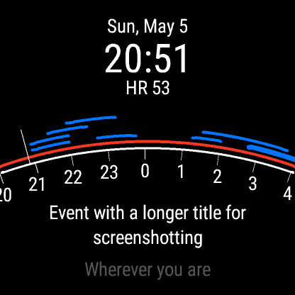
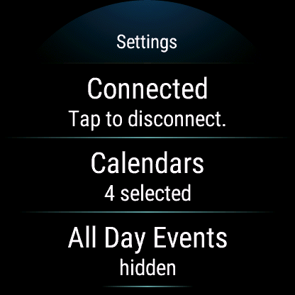
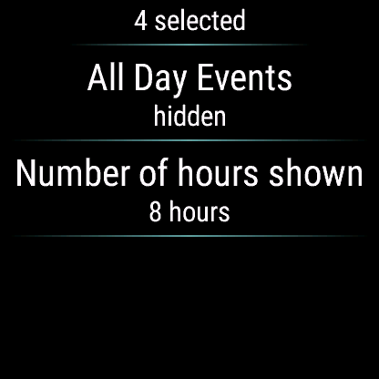

# Agenda Arc (for Garmin devices)

This is a(n improved and extended) port of [Agenda Arc
(Fitbit)](https://github.com/matthewwardrop/agenda-arc-fitbit) to Garmin
smartwatches; motivated by my personally moving to a Garmin Venu2. At time
of initial publishing, I have been running this watch-face on my watch for well over a year, and slowly refined things as they bugged me. I share this code in the hope that it is useful, but with no guarantees.

This watch-face currently only works with Google Calendar, because Garmin does not offer a calendar API, and so I had to write my own client for this.

## Screenshots (from a circular Garmin Venu 2)

